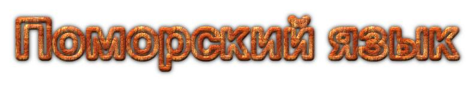
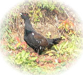
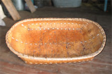
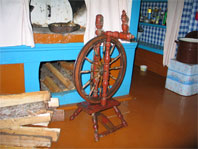
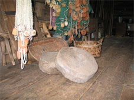
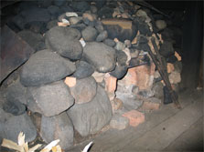
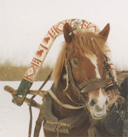

## Поморьска говоря

Язык поморов еще называют «Поморской говорью». Недавно вышел краткий словарь поморского языка «Поморска говоря». Советую изучить этот поморский словарь. Хотя он нуждается в дополнении, но в целом написан неплохо и дает хорошее представление о нашем коренном языке. ([скачать словарь](govorya/index.md))

Сам я коренной помор, родился и вырос в деревне Кимжа Мезенского района Архангельской области, где до сих пор большинство населения говорит на этом языке. Моя мать всю жизнь говорила по-поморски.

### Мои дополнения в Поморский словарь

#### Мезенско-Кимженский вариант



## Присказки и поговорки

Много слов связано с рыбалкой, рекой, морем, охотой и лесом, домом, лошадьми и сбруей, погодой.

Много эмоциональных выражений-присказок. Вот беда-то! Вот, дефки, беда-то! Чиста беда! Шшо ише дале будет! Слава, те господи! Ише не чише! Шшо деитцэ! Пошшо? Опять не слава Богу! Ох те мнеченько, тошнёхонько! Ох те, мне! Прости, ты господи! Шшо оно будёт? Коя дыра те нать? Только вьёт!

**Поговорки.** Не толкёт дак мелёт. Мал мала меньше. Всё бы хорошо, да … Троицка неделя — овечья смерть. От огня ничего не вспрянет. Дошш не дошш, а ись то хошь.

## Фотографии

Подписи к фотографиям: 

**Полотуха** — прялка без турачки;

**На повети** — каменица в бане;

**Расписна дуга**.
