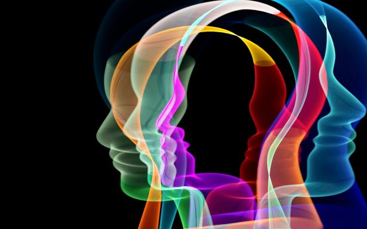

[Оригинал статті](https://www.derstandard.at/story/3000000332780/psychotherapeut-traumatisierten-menschen-faellt-es-oft-schwer-grenzen-zu-setzen-das-gefaehrdet-sie)

## {{ page.topic | escape }}

Психологічні травми, отримані внаслідок шокуючих подій, терапевти часто недооцінюють у моїх пацієнтів, зазначає травматерапевт Марк Гойсcер (Marc Heusser). Однак їх сліди можуть виявитися згубними.

### Інтерв'ю / Тілль Гейн (Till Hein) 26 липня 2026 р. 13:59 | Der Standard

<figure>
  
  <figcaption>Травмовані люди часто страждають від споминів-флешбеків, непоясненного болю або дисоціації. Терапія допомагає дізнатися, що́ достеменно спричиняє подібні симптоми. &copy;Getty Images</figcaption>
</figure>

Коли трапляється жахливий нещасний випадок, як-от пожежа в барі в Кран-Монтані (Crans-Montana) кілька місяців тому, всі звертаються до фахівців з травм, щоб допомогти потерпілим обробляти їхнє травматичне сприйняття. Проте, суспільство та влада часто залишати поза увагою, коли йдеться про домашнє насильство, статеве насильство або нехтування, повідомляє Марк Гойсcер. Травматолог з Цюриха вже 20 років лікує травмованих дітей та підлітків. Розмова про флешбеки, помилкові діагнози та шанси на одужання.

**STANDARD** — Термін «травма» — чимало поширений у наші дні. Складається враження, що іноді навіть, здавалося б, незначні пригоди впорядкуються як травматичні.

**Гойсcер** — Травма — це модне слово, безперечно так. Я вважаю це досить проблематичним. Якщо зразковий учень одного разу отримує оцінку «двійка» за шкільне завдання, це безсумнівно ще не травма. Навіть якщо його батькам це може видаватися інакше. Проте, справжня травма, зокрема після пережитого насильства або довгих років нехтування, досі звичайно залишається кримінально ігнорованою, а жертв не сприймають цілком поважно.

**STANDARD** — Ви можете навести якісь приклади?

**Гойсcер** — Так. Минулого року в Цюрихському університеті прикладних наук (ZHAW) було проведено опитування 1603 підлітків з Цюриха віком від 12 до 14 років. Більше ніж кожен четвертий повідомив, що пережив статеве насильство, починаючи від непристойних зауважень та ексгібіціонізму і закінчуючи обмацуванням та насильницьким статевим актом. А попереднє подібне дослідження в кантоні Женева показало, що приблизно кожна третя дівчина та кожен десятий хлопець зазнали сексуального насильства. Але мало хто проходив психотерапію. Втім багато досліджень показали, що сексуальне насильство порядно нерідко створює посттравматичний стресовий розлад. Але багато так званих фахівців недостатньо обізнані з цим питанням.

**STANDARD** — Тож травма таки не є модним діагнозом?

**Гойсcер** — Навпаки. Якщо дитина поводиться в школі якось незвично, її негайно випробують на СДУГ. Деякі психотерапевти також можуть спостерігати депресію чи аутизм. Але більшість виховників не зважає на травму. Зовсім недавно до мене направили 16-річного підлітка, у якого підозрювали СДУГ. На першому ж сеансі він розповів мені, що батько та мати били його протягом усього дитинства. Він явно страждав від посттравматичного стресового розладу.

**STANDARD** — І це не поодинокий випадок?

**Гойсcер** — Ні. Дослідження, проведене Цюрихським університетом кілька років тому, показало, що близько чотирьох відсотків молодих людей у Швейцарії страждають від такого розладу. А кількість припущених випадків, безумовно, ще вища. Наприклад, у 2024 році наукова праця дослідників з Університету Грайфсвальда (Greifswald) дійшла висновку, що 17 зі 102 психіатричних пацієнтів, яких вони обстежили, страждали від посттравматичного стресового розладу (ПТСР), який не був помічений під час діагностики. А за 20 років роботи терапевтом я також працював з незліченною кількістю дітей та підлітків, чия травма довгий час опинилася невизнаною.

**STANDARD** — Як ви це пояснюєте?

**Гойсcер** — Одним із факторів, ймовірно, є те, що деякі симптоми нагадують симптоми СДУГ, наприклад, сильний внутрішній неспокій і труднощі з тим, щоб сидіти на місці.

**STANDARD** — Які інші типові ознаки?

**Гойсcер** — Так звані дисоціації. Тіло постраждалої особи присутнє, але її увага ніби блукає деінде. При посттравматичному стресовому розладі такі стани можуть тривати годинами. Існує багато інших типів дисоціації. Деякі потерпілі неодноразово завдають собі ран і навіть не відчувають болю. Інші страждають від так званих флешбеків, яскравих споминів про травматичний момент, які раптово спливають, особливо вночі. Притім вони відчувають себе точно так само, як і в тодішніх обставинах. І вони неймовірно ускладнюють життя. Мій колишній пацієнт був отримав травму внаслідок дорожньо-транспортної пригоди. Білий фургон збив його машину з естакади. Він мало не втратив життя і три дні лежав у комі. Навіть через роки кожна подорож автомобілем була для нього нестерпною. Зрештою, білі фургони трапляються практично скрізь на дорозі.

**STANDARD** — Що викликає травму?

**Гойсcер** — При великій небезпеці організм повинен вибирати, чи битися, чи втекти. Але існує і третя можливість. Вона задіюєся, коли ви відчуваєте себе повністю безпорадним. Тоді ви завмираєте та прикидаєтеся мертвим. Цей захисний механізм, ймовірно, має еволюційне коріння. Якщо здобич перестає рухатися, хижаки іноді втрачають її з очей. До речі, у 2021 році Федеральний Верховний Суд Швейцарії нарешті визнав, що жертви статевого насильства здатні увійти в такий стан. Відтоді ґвалтівники більше не можуть просто стверджувати: «Опору не було, тому секс був за згодою».

**STANDARD** — Але завмирання несе негативні наслідки?

**Гойсcер** —  Так, вельми часто. Образно кажучи, це як водночас натиснути на педаль газу та різко загальмувати. В результаті люди часто страждають від дисоціації, хронічної м’язової напруги та флешбеків. А їхня нервова система залишається в постійному стані готовності.

**STANDARD** — Тож потерпілі особливо схильні до стресу?

**Гойсcер** —  Не тільки до стресу. Наукові дослідження показали, що від 30 до 40 відсотків усіх випадків депресії та щонайменше 30 відсотків зловживання психоактивними речовинами можна простежити до ранньої травми. Дослідження 2024 року, проведене німецькими психологами за участю 156 807 дорослих, також показало, що особи, хто пережив травму в дитинстві, мають значно вищий ризик розладів занепокоєння, діабету, захворювань легень, серцевих нападів та раку, ніж ті, хто не зазнав такої травми. А старіше масштабне оглядове дослідження з США показало, що діти, які пережили ранню травму, частіше потрапляють у ДТП у дорослому віці та мають підвищений ризик стати жертвою статевого насильства.

**STANDARD** — Чому це так?

**Гойсcер** — Травматованим особам зазвичай не вдається добре піклуватися про себе та встановлювати межі. Це особливо стосується травм прив’язаності, які сягають корінням у раннє дитинство. Якщо маленьким дітям не надається доволі безпеки та вигод, вони зрештою починають сприймати це як «нормальне» та вважати, що і не заслуговують на краще. Це нерідко складає їхню власну поведінку.

**STANDARD** — Чи можна ототожнювати «травму» з важким дитинством?

**Гойсcер** — Не доконечно. Багато чинників можуть призвести на травму. Наприклад, напади, переживання війни, дорожньо-транспортні пригоди, тортури, лавини, домашнє насильство, сексуальні домагання, зрозуміло, також нехтування в дитинстві. Гарна новина полягає в тому, що навіть ті, хто пережив найважчу травму, за допомогою фахівців часто можуть досягти рівноваги через два-три роки . У середньостроковій перспективі система охорони здоров’я могла б заощадити багато грошей, якби її посадовці поважніше ставилися  до питання травми.

**STANDARD** — Повертаючись до вочевидь травматичної події – новорічної пожежі в Кран-Монтані. Чи потрібна травмотерапія якомога швидше всім безпосереднім свідкам такої пригоди?

**Гойсcер** — Психологи довгий час вважали, що так. Терапевти поспішали на місця пригод і дозволяли людям розповідати свої історії. Це мало на меті запобігти посттравматичному стресовому розладу. Тим часом численні тематичні дослідження показали, що такі так звані *дебрифінґи* можуть легко стати навіть шкідливими. Ймовірно, що у деяких випадках такий настирливий підхід сам уселів травму.

**STANDARD** — Що б до цього могло спричинити?

**Гойсcер** — Чи розвиватиметься посттравматичний стресовий розлад, також значно залежить від того, скільки підтримки отримує людина після струсу. Якщо жертви та свідки швидко знову почуваються в безпеці, прогноз буде досить хороший. Деякі очевидці відчувають потребу оповідати, висловлювати. Їх слід вислухати. Інші воліють не висловлювати, мовчати. Їх ніяк не варто примушувати до висловлювань.

**STANDARD** — Чому не варто?

**Гойсcер** —  Дослідники мозку виявили, що в години відразу після жахливої події переживання переробляється у свідомості з особливою потужністю та пов'язується з іншим змістом. Якщо під час цієї чутливої фази спогад про пережитий страх підкріплюється, наприклад, через дебрифінґ, ризик посттравматичного стресового розладу (ПТСР) зростає. Спочатку розвага, відволікання уваги часто є найкращим ліком для потерпілих, нехай це просто відеогра.

**STANDARD** — Чи можна виміряти тяжкість ПТСР?

**Гойсcер** —  Перепади частоти серцевих скорочень дозволяють певною мірою зробити висновки про ступінь травматизації людини. Рівень певних гормонів стресу в крові здатний свідчити про те, чи людина зазнає періодів внутрішнього спокою, чи її нервова система все ще постійно перебуває в режимі надзвичайного стану. На підставі поточних та минулих симптомів, опитування вимірюють біопсихосоціальні порушення, спричинені посттравматичним стресовим розладом (ПТСР).

**STANDARD** — Чи є деякі люди настільки стійкими, що їх неможливо травмувати за жодних обставин?

**Гойсcер** — Я вважаю це малоймовірним. Наприклад, можна було б подумати, що вояки стають надзвичайно загартованими на війні. Однак після повернення з війни у В'єтнамі сотні тисяч ветеранів збройних сил США страждали від флешбеків, а багато хто скоїв і самогубство. Саме на цьому тлі ПТСР вперше було визнано психічним захворюванням у 1980 році.

**STANDARD** — До 2025 року Міжнародна класифікація хвороб (МКХ-10) по суті перераховувала лише один ПТСР. Однак поточне видання, МКХ-11, раптово описує понад 20 різних таких розладів. Як це сталося?

**Гойсcер** —  Травма зараз є мабуть найкраще дослідженою галуззю психічних захворювань. Вчені, наприклад, показали, що існують немалі відмінності, зокрема стосовно до симптомів. Спогади особливо поширені після дорожньо-транспортних пригод. Втім, багато жертв сексуальних домагань борються переважно з ненавистю до себе, соромом та почуттям провини. Вони відчувають себе неповноцінними.

**STANDARD** — Чому вони не спрямовують свої лютощі на кривдника?

**Гойсcер** —  Під час нападу вони відчували себе беззахисними. Це має тривалий ефект. Стає все більш безперечним, що відчуття колишньої безпорадності деяким чином зберігається в організмі і далі після травматичної події.

**STANDARD** — Чи може травма передаватися потомству?

**Гойсcер** —  Це було продемонстровано в дослідженнях на тваринах. Мікробіологи виявили епігенетичні метилювання, типові для травми, як у мишей, травмованих шокуючим переживанням, так і у їхнього потомства, яке не зазнало такого стресу. Це свого роду тонке налаштування, яке впливає на те, чи долучаються до роботи ті чи інші гени, і цей ефект зберігається протягом кількох поколінь. Такі дослідження годі проводити на людях, але фахівці припускають схожі наслідки. Безперечно те, що травма часто глибоко визначає поведінку батьків. Особи, які страждають від посттравматичного стресового розладу, часто надибають на труднощі і з відчуванням і з вираженням своїх емоцій. Це не раз відображається і на їх потомстві.

**STANDARD** — Але ж саме по собі це не травматично?

**Гойсcер** — Якщо батьки дбають про свою дитину протягом однієї хвилини, не виявляючи жодних емоцій на своєму обличчі, всі немовлята впадають в роспач. Це було продемонстровано у відомому дослідженні «Застигле обличчя» ("Still-Face") 1982 року. Немовлята починають відтак люто протестувати, доки не буде відновлено емоційного зв’язку. Тепер уявіть собі, що дитині дісталися травмовані, емоційно пошкоджені батьки. Вона опиниться в критичному становищу, яке триватиме роками. Важко дійти висновку, що згодом це не залишить за собою ознак на психіці.

**STANDARD** — Чи намагаєтеся Ви під час терапії стерти травматичні картини з їхньої свідомості?

**Гойсcер** — Ні. Це було б марно. Йдеться про м’яке зменшення емоційного заряду таких картин та інших уривків спогадів.

**STANDARD** — Як це працює?

**Гойсcер** —  Часто через так звану конфронтацію, але поволі. Однією з моїх перших пацієнток із клінічним досвідом смерті була молода панна, яка страждала від хронічної тривоги та флешбеків. У віці п’яти років вона мало не втопилася в озері. Після того, як ми побудували довірливі стосунки протягом кількох сеансів, я поклав руку їй на плече і попросив її докладно розповісти про ту жахливу подію. Протягом усього часу я постійно запевняв її: «Ти не сама, я тут, щоб підтримати тебе». Багато травматичних переживань залишають відчуття самотності.  Визначальним потерпанням є безсилля.

**STANDARD** — Хіба не впала Ваша пацієнтка знову  в паніку?

**Гойсcер** —  Ні, не впала. Вирішальним фактором є те, щоб травматовані особи почували себе безпечними та захищеними під час такої конфронтації. Як тільки встановлюються добрі стосунки, і пацієнт більше не перебуває в гострій кризі, Ви зможете разом з ним протистояти струсу травмі.

**STANDARD** — Що терапевтичного в такій конфронтації?

**Гойсcер** —  Зазвичай травматичні спогади емоційно надзвичайно смучують, але є розрізненими. Ізольовані звуки, образи, запахи. Якщо пережити цілий шокуючий момент разом з пацієнтами в безпечному середовищі, він поступово може зберігтися в свідомості як своєрідний звичайний наратив. Це послаблює негативний ефект розкиданих спогадів.

**STANDARD** — Чи можливо лікуватися самостійно?

**Гойсcер** —  Деяким пацієнтам це вдається. Але зазвичай дуже важливим є аспект стосунків. Зрештою, всі ми — неймовірно гуртові ссавці. Про це є один повчальний відеоролик: слоненя йде поруч зі своїм батьком, спіткнувся об стовбур дерева та приземлився собі на спину. Безпорадне, як жук, воно закидає всі чотири кінцівки в повітря. Батько цього не помічає; він просто ходить далі. Але малюк здається повністю розгубленим. Потім з'являються три слонихи. Слоненя помічає, що вони наближаються. І враз йому вдається розвернутися та встати. Те саме стосується і людей. Щойно нас визнають у нашому горі, щойно ми відчуваємо, що ми не самотні, це часто запускає величезні процеси самозцілення.

**STANDARD** — Як часто ви бачите своїх пацієнтів під час такої напруженої фази?

**Гойсcер** — Зазвичай вони приходять до клініки раз на тиждень. Але будь-хто, хто переживає гостру кризу, можливо, навіть думає про самогубство, природно, отримує мій номер мобільного телефону та може зателефонувати мені будь-коли.

**STANDARD** — «Що розум забув, не забуло тіло — на наше щастя», — вважав, кажуть, Зигмунд Фройд, засновник психоаналізу.

**Гойсcер** —  Він усвідомив тут щось важливе. Але, на жаль, Фройд не розвивав цей аспект у своїй терапевтичній праці. Більшість його учнів також ні. Лише нещодавно стали популярнішими психотерапевтичні методи, які приділяють окрему увагу тілу та його «пам’яті».

**STANDARD** — Американський психолог і біофізик Пітер Левін (Peter Levine) стверджує, що можна зцілити травму, просто «усвідомлено налаштувавшися на себе / вслухавшися в себе». Чи може це так спрацювати?

**Гойсcер** —  Я ціную м’яку терапевтичну методику Соматичний досвід (Somatic Experiencing, SE), який розробив Пітер Левін. Це один із найважливіших інструментів у моїй роботі.

**STANDARD** — Як проходять такі сеанси?

**Гойсcер** —  Дійсно, початкова увага зосереджена не на травмі. Пацієнти зосереджують свою увагу на своєму тілі. Вони відчувають, де торкаються землі, можливо, також, які групи м’язів особливо напружені. Тоді, зазвичай, незабаром стає зрозуміло, що їм потрібно. Деякі, наприклад, через деякий час починають сильно тремтіти. Інші можуть відчувати стиснення в грудях, відчуття стиснення. Через деякий час можна спрямувати свою увагу на те, чи є також частини їхнього тіла, які відчуваються сильнішими або «здоровішими».

**STANDARD** — Звучить вимогливо.

**Гойсcер** — За терапевтичної підтримки деякі пацієнти взагалі не вважають це особливо складним. Наприклад, намагаються направляти сприйняття пацієнтів туди-сюди між негативними та більш позитивними відчуттями у власному тілі. На такий спосіб, можна обробити багато емоційних ран, до яких важко отримати доступ лише за допомогою розмовної терапії або які навіть неможливо відтворити зором. І як би дивно це для Вас не звучало: за допомогою таких сеансів можна назавжди змінити усвідомлення свого тіла та своє емоційне життя.

**STANDARD** — Чи існують також ліки від посттравматичного стресового розладу (ПТСР)?

**Гойсcер** — Ні. Звичайно, не як готове рішення. Однак дослідження показують, що деякі речовини можуть бути корисними при посттравматичному стресовому розладі та значно підтримувати терапію травм. Наприклад, за терапевтичного супроводу, MDMA (за використанням Methylendioxy-N-methylamphetamin = Ecstasy) може допомогти травмованим людям відновити кращі стосунки зі своїм тілом та зв'язок з іншими. За словами голландського психіатра Бесселя ван дер Колка (Bessel van der Kolk), це дві найважливіші проблеми для травмованих людей. Ця речовина стимулює формування нових зв'язків між нервовими клітинами мозку. Це, ймовірно, полегшує збереження нового досвіду в пам'яті. Швейцарія є світовим лідером у цій галузі: з 2014 року лікарі можуть звертатися до Федерального управління охорони здоров'я за спеціальними дозволами на такі речовини для окремих пацієнтів віком від 18 років. Це — позитивний крок. (Інтерв'ю: Тілль Хайн, 26 липня 2026 р.)

\* \* \*

Марк Гойсcер, 66 років, отримавши два ступені магістра (один з фаха електротехніка та другий з управління торговельним підприємством), закінчив у 2002 році додаткове навчання з психотерапевтичних наук в ETH Zürich за програмою Швейцарської хартії психотерапії. З 2002 року він працював у різних установах, зокрема в лікарні міста Трімлі (Triemli), в лікарні Аффольтерна-на-Альбісі (Affoltern am Albis) та в Центрі психотравматології Швейцарського Червоного Хреста. Він пройшов навчання та безперервну освіту з тілесно-орієнтованих терапевтичних підходів, таких як Соматичний досвід (SE) та PITT-KID. У 2020 році він заснував у Цюриху Центр компетенцій "daosoma" для лікування травмованих дітей та підлітків, яким він керує разом з психіатркою Барбарою Ґаздік.

---

Більше на цю тему:

Між сп'янінням та зціленням: повернення психоделіків

Кайф для психіки: як працює терапія за допомогою MDMA?

Травма: коли психіка відмовляється працювати

© Видавніцтво STANDARD 2026

Усі права захищено. Вживати виключно собі для користь.
